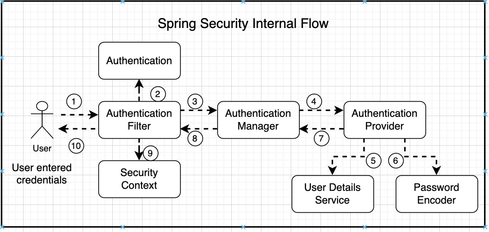
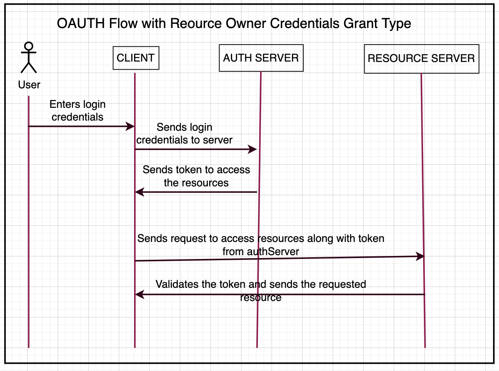

# service-oauth Coding Guideline

# Table of Contents
1. [What is this document](#purpose)
1. [Design Pattern](#designPattern)
1. [Security Context](#security)
1. [Exception Handling](#exceptionHandling)
1. [Integration Pattern](#integrationPatten)
1. [Database Pattern](#databasePatten)
1. [API documentation - Swagger](#swagger)
1. [Health Check](#healthCheck)
1. [Logging Strategy](#logging)
1. [Naming Convention](#namingConvention)
---
# What is this document <a name="purpose"></a>
service-oauth is a spring boot microservice project that ensures authentication and authorization for dataOps IAM. This documents outlines all the coding principles and best practices followed to develop this project. 

# Design Pattern <a name="designPattern"></a>
Microservices, aka microservice architecture, is an architectural style that structures an application as a collection of small autonomous services, modeled around a business domain. In a Microservice Architecture, each service is self-contained and implements a single business capability.

# Security <a name="security"></a>
## Security Context
Security is protecting your data and business logic inside your web applications. In web applications security can be implemented in different ways like using firewalls, HTTPs, SSL, Authentication, Authorisation etc. Using security we can avoid most common attacks like CSRF, broken Authentication inside the application. Security should be considered right from the development phase itself along with business logic. 
In authServer project, spring-security module has been used to ensure security of its rest api’s. Diagram below describes how spring security works internally.



- Step1: user tries to consume the api’s from browser.

- Step2: Authentication filter intersepts the request, it will try to convert the authentication details (like username, password) sent from the browser by the user into an authentication object. Authentication object is the based where all the validation of the user credentials will be validated in the further steps. 
- Step3: Once the authentication object is built, it will be passed to the authentication manager. Manager would decide which authentication provider the request should goto.
- Step4:  There can be various Authentication providers like database, ldap, OAuth etc. Once Authentication provider receives the request, here all the business logic (login related to security) will be implemented. Authentication provider will in turn use two other interfaces - UserDetailsService and Password encoder.
- Step5: UserDetailsServices is the interface which holds user schema. There might be a scenario where User has username, password, top, multi factor authentication. All these schema we can identify under the User and UserDetails services. 
- Step6: Password encoder is another interface which specifies how the password will be encrypted, encoded or decrypted during validation. Spring security provides many password encoders such as BCrypt password encoder, NoPassword encoder etc. 
authServer users BCryptPasswordEncoder. 
- Step7: Once authentication provider using UserDetailsService and PasswordEncoder validates the input credentials, flow will return to authentication manager followed by the authentication filter. 
- Step8: Now my authentication object, which was initially sent from AuthenticationFilter will hold information like - if the user is a valid authenticated user, what are the authorities and roles associated to the authenticationObject. 
Once AuthenticationFilter receives the authentication object back from AuthenticationManager, it will pass the object to the SecurityContext, where the user details will be stored inside the container. Authentication will hold the token, which will be stored inside the spring container using the SecurityContext interface. 
- Step9: SecurityContext is the place where we save the data of the user authenticates themselves
- Steps10: Once validation is complete, authentication is sent back to the browser. In the 2nd time onwards if the users tries to entr the same security information, this entire flow will not get executed anymore. From the SecurityContext, spring can tell if the token is a valid or invalid token.

## OAuth2 and GrantType
On top of Spring security framework, authServer also implements oAuth2 framework to bring below improvements: 
- With HTTP basic authentication between client and backend interactions, we need to share the user credentials multiple times unnecessarily over the network.
- Backend application will keep executing the authentication logic every time the request comes from the client. 

These issues are avoided by using JWT token or oAuth2 mechanism, where share the credentials only first time. For subsequent calls from UI to authServer, user credentials will not be required. Server will perform token based authorisation. 

There are 5 different grant types in oAuth2 flow:
- Authorisation Code
- Implicit
- Resource owner password credentials
- Client Credentials
- Refresh Token
authServer implements Resource owner password credentials grant type. 
The basic assumption for this grant type is our client, authServer and resource server belongs to same organisation. oAuth2 flow with this grant type is as shown below: 



# Exception Handling <a name="exceptionHandling"></a>
In authServer deals with the separation of concerns very well by implementing a dedicated class (AdminAPIErrorHandler) for exception handling. 
The class is annotated with @ControllerAdvice annotation to promote a unified exception handling throughout a whole application. The app can throw exceptions normally to indicate a failure of some kind, which will then be handled separately in the AdminAPIErrorHandler class.

# API documentation - Swagger <a name="swagger"></a>
authServer includes springdoc-openapi-ui (version: 1.5.13) dependency in order to automate the generation of API documentation (Swagger page).

```
<dependency>
    <groupId>org.springdoc</groupId>
    <artifactId>springdoc-openapi-ui</artifactId>
    <version>1.5.13</version>
</dependency>
```` 
To implement Swagger, authServer creates a bean of type OpenAPI in the main class as below. 

```
@Bean
public OpenAPI customOpenAPI() {
    return new OpenAPI().addSecurityItem(new SecurityRequirement().addList("bearerAuth"))
            .components(new Components().addSecuritySchemes("bearerAuth",
                    new SecurityScheme().name("bearerAuth").type(SecurityScheme.Type.HTTP).scheme("bearer")
                            .bearerFormat("JWT")))
            .info(new Info().title("DataOps IAM - Backend Services for Tenant Portal").version("v2.0").description(
                    "Services to perform CRUD operations on following Tenant portal entities: Organization, Team, Team and User"));
}
```
Swagger page for the application can be accessed using the link below: 
http://<host>:<port>/swagger-ui/index.html?configUrl=/v3/api-docs/swagger-config#/

# Logging Strategy <a name="logging"></a>
authServer logs all important transactions and exceptions in the standard output. Here also separation of concerns has been taken care by creating a centralized logger object in the LogConfig class. 
static Logger object created in one place and has been accessed in all the classes throughout the application. 
This way we save memory as we avoid to create multiple static Logger objects. 

# Integration with other APIs <a name="integrationPatten"></a>
authServer invokes drools apis to get the mapped roles for a given roleType. 
Standard RestTemplate has been implement to make the api calls. 